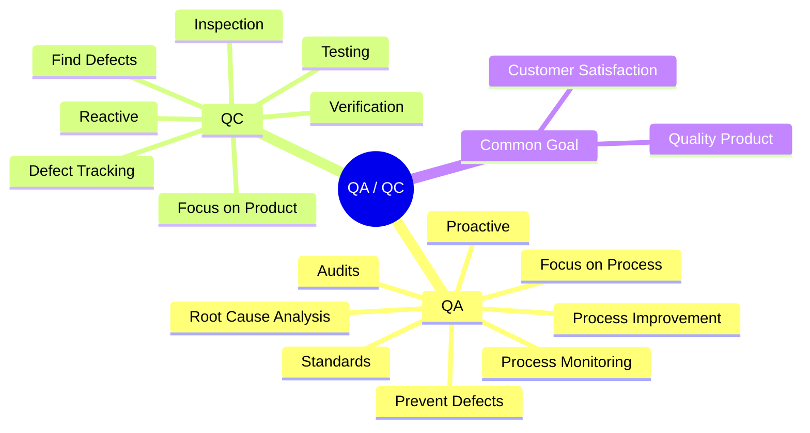

# QA/QC mindmap

```mermaid
mindmap
  root((QA / QC))

    QA
      Proactive
      Focus on Process
      Prevent Defects
      Standards
      Audits
      Process Monitoring
      Root Cause Analysis
      Process Improvement

    QC
      Reactive
      Focus on Product
      Verification
      Find Defects
      Testing
      Inspection
      Defect Tracking

    Common Goal
      Quality Product
      Customer Satisfaction
```